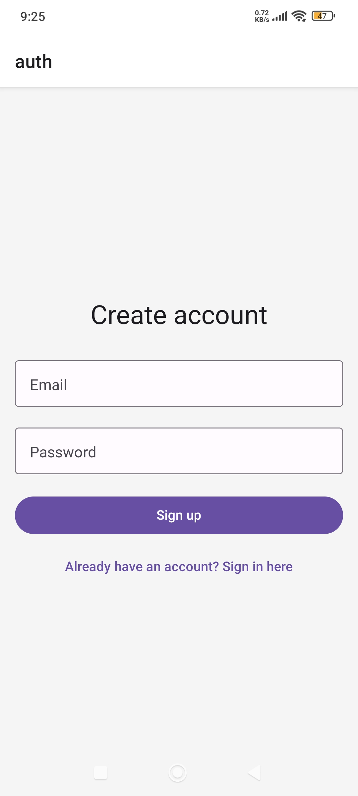
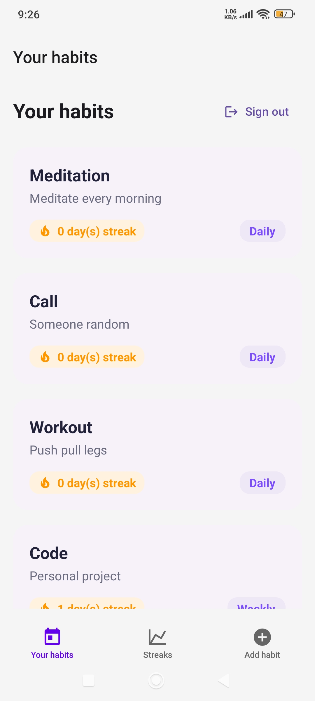
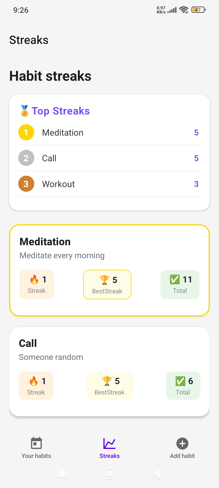
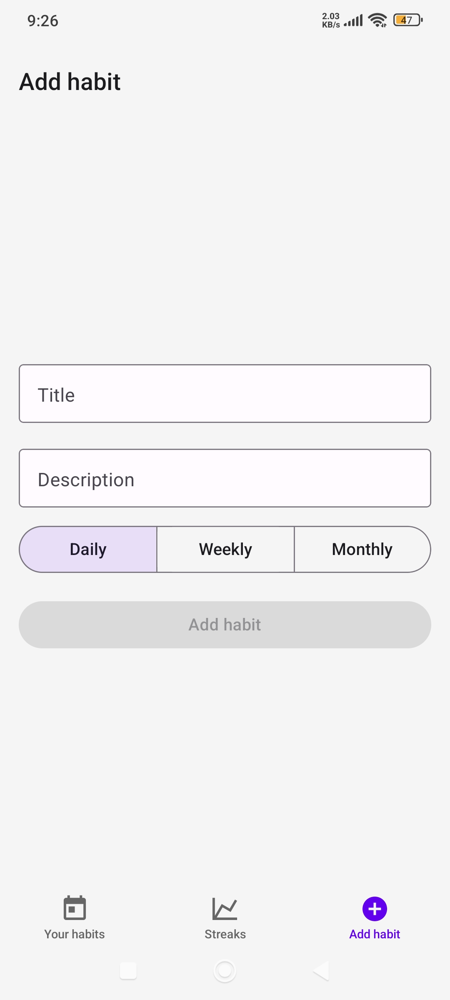

# Habit Tracker Mobile App

## 📌 Description
A habit-tracking mobile application that helps users track daily habits and build consistency over time.
Developed with the help of a tutorial to learn React Native with the Expo framework and the use of [Apprwrite](https://appwrite.io) to handle the backend.

This project is currently **a work in progress** and is being actively developed.

## 🛠️ Tech Stack
- React Native
- Expo
- TypeScript
- Appwrite

## ✨ Features
- Authentication with email and password
- Create and manage daily, weekly or monthly habits
- Swipe habit to left to complete and right to delete
- Track habit completion and streaks
- Habits ranked by streak consistency
- Clean and simple mobile UI

## 🚀 Getting Started
1. Clone the repository:
```bash
git clone https://github.com/RyanIaro/Habit-tracking-app.git
```
2. Install dependencies:
```bash
npm install
```

3. Start the Expo development server:
```bash
npx expo start
```

## 📚 What I Learned
- Building mobile apps with React Native and Expo
- Improved TypeScript skills
- Using Appwrite's databases and query class
- Mobile UI considerations

## ⚠️ Notes
- Started with a tutorial video for learning purposes
- Project still in development
- Currently improving/adding features
- Not deployed yet

## 📸 Screenshots
- Sign up/Sign in


- Habit list


- Streaks ranking


- Add habit
